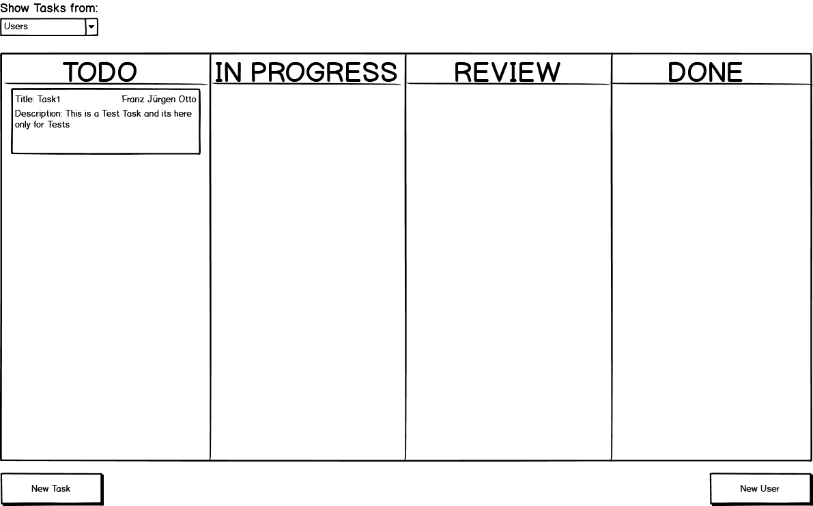
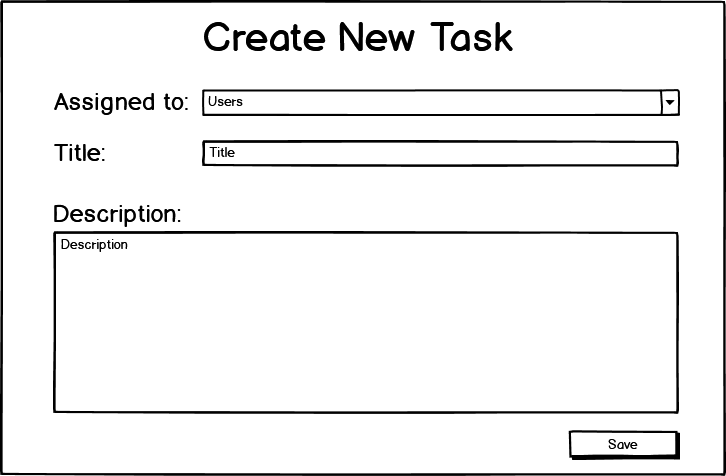
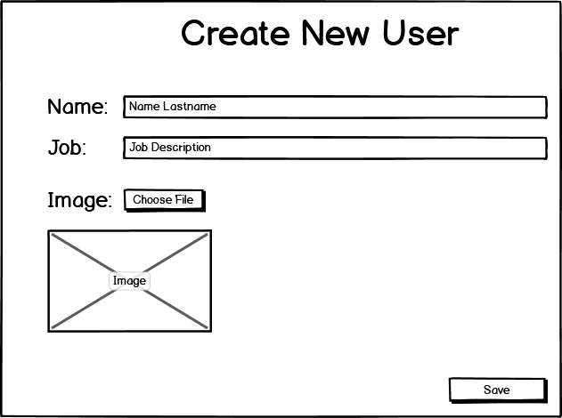

# M120 N-N_Scrumboard
## Inhaltsverzeichnis
* [Einleitung](#einleitung)
  * [Autor](#autor)
  * [Projekt](#projekt)
* [Planung](#planung)
  * [User Stories](#userstory)
  * [UseCase Diagram](#udiagramm)
  * [Mockups](#mockups)
  * [Prototyp](#prototyp)
* [Testing](#testing)
  * [Testfälle](#testfaelle)
  * [Testprotokoll](#testprotokoll)

<a name="einleitung"/>

## Einleitung

Unser Ziel mit diesem kleinen Projekt vom Modul 120 ist es die bis jetzt gelernten Fähigkeiten umzusetzten. Wir (Noah Ziltener und Nick Durrer) hatten die Idee ein Scrumboard mit MVVM zu erstellen.

<a name="autor"/>

### Autor und Dokument
* Autor: **Noah Ziltener & Nick Durrer**
* Erstelldatum: **22.05.2020**
* letzte Aktualisierung: **22.05.2020**

<a name="projekt"/>

### Projekt
* Projektstart: **22.05.2020**   
* Projektende: **-** 

<a name="planung"/>

## Planung

<a name="userstory"/>

### User Stories

#### User Storie #1
    Als User,
    will ich einen Task mit Titel und Beschreibung ertstellen
    damit ich den Task im ToDo ansehen kann.
    
#### User Storie #2
    Als User,
    will ich einen Task per Drag and Drop in ein anderes Feld ziehen
    damit der Status des Tasks geändert wird.
    
#### User Storie #3
    Als User,
    will ich einer Task einer Person zuweisen
    damit der Task dieser Person untergeortnet ist.
    
#### User Storie #4
    Als User,
    will ich Tasks nach Person sortieren
    damit ich einen besseren Überblick habe.
    
#### User Storie #5
    Als User,
    will ich neue Personen mit Name und Job erstellen
    damit ich Tasks neuen Personen zuweisen kann.
    
### Zeitplanung
| Paket | Person | End-Datum | Status|
| ----------- | -------------- | ------ | --------------------------------- |
| Mokups erstellen | Nick Durrer | 22/05/2020 | ✅|
| Unser Stories erstellen | Noah Ziltener | 22/05/2020 | ✅ |
| Prototyp mit MVVM umsetzten (Tutorials schauen) | Noah Ziltener / Nick Durrer | 29/05/2020 | ✅ |
| Bedienungskonzept | Nick Durrer | 29/05/2020 | ✅ |
| Aufbau Applikation besprechen | Noah Ziltener / Nick Durrer | 29/05/2020 | ✅ |
| Scrumboard in XAML umsetzen | Nick Durrer | 05/06/2020 | ✅ |
| Create Task View in XAML umsetzen | Noah Ziltener | 05/06/2020 | ✅ |
| Create User View in XAML umsetzen | Noah Ziltener | 05/06/2020 | ✅ |
| Task erstellen Logik | Nick Durrer | 12/06/2020 | ❌ |
| User erstellen Logik | Noah Ziltener | 12/06/2020 | ❌ |
| Task Sortirung | Nick Durrer | 19/06/2020 | ❌ |
| Drag and Drop von Scrum Board | Noah Ziltener | 19/06/2020 | ❌ |
| Testen & Resüme | Noah Ziltener / Nick Durrer | 26/06/2020 | ❌ |

<a name="udiagramm"/>

### Mockups
#### ScrumBoard

#### Bedienungskonzept
- Board Allgemein: Es soll möglich sein die verschiedenen Tasks im Board zwischen den 4 verschiedenen Spalten zu verschieben (Drag and Drop).
- Show Tasks from Button: Mit diesem Knopf ist die Idee das man nach User sortieren kann und dann nur die Aufträge dieser User sieht.
- New Task Button: Mit dem New Task Button öffnet sich das Create Task Fenster um einen neuen Task zu erstellen.
- New User Button: Mit dem New User Button öffnet sich das Create User Fenser um einen neuen User zu erfassen.
- Edit Button: Mit dem Edit Button bei einem Task soll sich das Create Task Fenster öffnen mit den aktuellen Daten, um diese dann zu bearbeiten.

#### Create Task

#### Bedienungskonzept
- Assigned To Dropbox: Dort soll man zwischen allen User auswählen können wer diesen Task bearbeiten soll.
- Title Textbox: In dieser Box soll der Titel für den Task festgelegt werden.
- Description Textarea: In diesem Feld soll man den Task beschreiben können.
- Save Button: Mit dem Save Button wird ein neuer Task erstellt.

#### Create User

#### Bedienungskonzept
- Name Textbox: In dieser Textbox kann der Name des neuen User erfasst werden.
- Job Textbox: In dieser Textbox wird der Job des Users erfasst.
- Image Button: Beim Image Button soll sich der Explorer öffnen um ein Profilbild zu wählen.
- Save Button: Mit dem Save Button wird ein neuer User erstellt.

<a name="prototyp"/>

### Prototyp
#### Linksammlung

| Link | Kommentar |
| ----- | ------------ |
| https://riptutorial.com/mvvm | Das Tutorial war Gut. WIr haben es beide parallel gemacht. Bei Noah hat es ganz am Schluss des Tutorials Errors gegeben. Es gab Problemme mit dem XAML Code. Wir konnte das Problemm nicht lösen was ein bischen frustriren war. Noah hat dan am Schluss das Projekt von Nick genommen und es hat alles Funktioniert. Das Tutorial hat gut erklährt wie MVVM aufgebaut ist und wie man es umsetzen muss. Das Programm hatte aber keine funktion also habe wir uns noch ein anders Tutorial gesucht.|
| https://riptutorial.com/wpf/example/992/basic-mvvm-example-using-wpf-and-csharp | Das Tutorial hat weniger erklähr wie MVVM funktioniert sonder einfach den Code aufgezeigt. Wir haben das Programmcode abgeschrieben und haben ihn analysiert. Wir habe uns gegenseitg den Code erklährt. Wir habe auch unterschied zu dem ersten Tutorila gefunden z.B. bei der OnPropertyChange Methode. Wir fanden das beim Zweiten Prototyp mehr Funktion vorhanden war und man mehr das Prinzip von Databinding zu vrstehen.|
<a name="testing"/>

### Testfälle

<a name="testfaelle"/>

<a name="testprotokoll"/>

### Testprotokoll

| Test | Testperson | Datum | Status|
| ----------- | --------- | ------ | --------------------------------- | 
| - | - | - | ✅ / ❌  | 
| -| - | - | ✅ / ❌ | 
| -| - | -| ✅ / ❌  | 
| -| -| - | ✅ / ❌  | 
| - | - | - |✅ / ❌ |
| -    | - |-|✅ / ❌ |  

