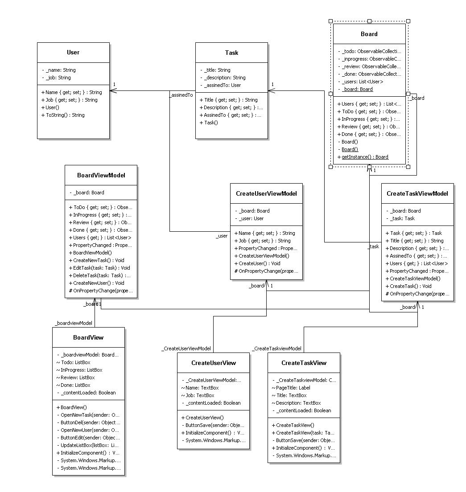

# M120 N-N_Scrumboard

## Inhaltsverzeichnis
* [Einleitung](#einleitung)
  * [Autor](#autor)
  * [Projekt](#projekt)
  * [Lernjournal](#lernjournal)
* [Funktionen](#funktionen)
* [Planung](#planung)
  * [User Stories](#userstory)
  * [UseCase Diagram](#udiagramm)
  * [Mockups](#mockups)
  * [Prototyp](#prototyp)
  * [Klassendiagramm](#klassendiagramm)
* [Testing](#testing)
  * [Testprotokoll](#testprotokoll)
  * [Bugs](#bugs)
* [Resüme](#resüme)

<a name="einleitung"/>

## Einleitung

Unser Ziel mit diesem kleinen Projekt vom Modul 120 ist es die bis jetzt gelernten Fähigkeiten umzusetzten. Wir (Noah Ziltener und Nick Durrer) hatten die Idee ein Scrumboard mit MVVM zu erstellen.

<a name="autor"/>

### Autor und Dokument
* Autor: **Noah Ziltener & Nick Durrer**
* Erstelldatum: **22.05.2020**
* letzte Aktualisierung: **22.05.2020**

<a name="projekt"/>

### Projekt
* Projektstart: **22.05.2020**   
* Projektende: **-** 

<a name="lernjournal"/>

### Lernjournal
Unser Lernjournal kann unter folgendem Link gefunden werden: [Lernjournal](/Lernjournal)

<a name="planung"/>

<a name="funktionen"/>

## Funktionen
In der Tabele ist ersichtlich welche Funktionen umgesetz wurden und welche nicht.
| Feature | Status | Beschreibung                      |
| ----------- | ------ | --------------------------------- | 
| Task erstellen |✅| Task kann mitels Dialog erstellt werden |
| Task anzeigen |✅| Tasks werden auf dem Board angezeigt |
| Task bearbeiten |✅| Task kann mitels Dialog bearbeiten werden |
| Task löschen |✅| Task kann mitels Button gelöscht werden |
| Task filtern |❌| Dieses Feature konnten wir leider zeitlich gesehen nicht mehr umsetzen, da wir uns lieber auf das Drag and Drop fokusiert haben.  |
| User erstellen |✅| User kann mitels Dialog erstellt werden |
| User bearbeiten |❌| Dieses Feature konnten wir leider zeitlich gesehen nicht mehr umsetzen, da wir uns lieber auf das Drag and Drop fokusiert haben. |
| Drag and Drop |✅| Tasks können mitels Drag and Drop verschoben werden |
| Responsive |✅| Das Board bietet ein responives Design an |

Meine eigene Idee war bei der Verbindungssuche ein Button einzubauen. Der Button den Inhalt der beiden Textboxen.

## Planung

<a name="userstory"/>

### User Stories

#### User Storie #1
    Als User,
    will ich einen Task mit Titel und Beschreibung ertstellen
    damit ich den Task im ToDo ansehen kann.
    
#### User Storie #2
    Als User,
    will ich einen Task per Drag and Drop in ein anderes Feld ziehen
    damit der Status des Tasks geändert wird.
    
#### User Storie #3
    Als User,
    will ich einer Task einer Person zuweisen
    damit der Task dieser Person untergeortnet ist.
    
#### User Storie #4
    Als User,
    will ich Tasks nach Person sortieren
    damit ich einen besseren Überblick habe.
    
#### User Storie #5
    Als User,
    will ich neue Personen mit Name und Job erstellen
    damit ich Tasks neuen Personen zuweisen kann.
    
### Zeitplanung
| Paket | Person | End-Datum | Status|
| ----------- | -------------- | ------ | --------------------------------- |
| Mokups erstellen | Nick Durrer | 22/05/2020 | ✅|
| Unser Stories erstellen | Noah Ziltener | 22/05/2020 | ✅ |
| Prototyp mit MVVM umsetzten (Tutorials schauen) | Noah Ziltener / Nick Durrer | 29/05/2020 | ✅ |
| Bedienungskonzept | Nick Durrer | 29/05/2020 | ✅ |
| Aufbau Applikation besprechen | Noah Ziltener / Nick Durrer | 29/05/2020 | ✅ |
| Scrumboard in XAML umsetzen | Nick Durrer | 05/06/2020 | ✅ |
| Create Task View in XAML umsetzen | Noah Ziltener | 05/06/2020 | ✅ |
| Create User View in XAML umsetzen | Noah Ziltener | 05/06/2020 | ✅ |
| Task Model erstellen | Nick Durrer | 12/06/2020 | ✅ |
| User Model erstellen | Noah Ziltener | 12/06/2020 | ✅ |
| Board Model erstellen | Noah Ziltener | 12/06/2020 | ✅ |
| Tasks anzeigen Logik | Noah Ziltener & Nick Durrer | 12/06/2020 | ✅ |
| Task erstellen Logik | Nick Durrer | 19/06/2020 | ✅ |
| User erstellen Logik | Noah Ziltener | 19/06/2020 | ✅ |
| Task Sortirung | Nick Durrer | 19/06/2020 | ❌ |
| Drag and Drop von Scrum Board | Noah Ziltener | 19/06/2020 | ✅ |
| Testen & Resüme | Noah Ziltener / Nick Durrer | 26/06/2020 | ✅ |

<a name="udiagramm"/>

### Mockups
#### ScrumBoard

#### Bedienungskonzept
- Board Allgemein: Es soll möglich sein die verschiedenen Tasks im Board zwischen den 4 verschiedenen Spalten zu verschieben (Drag and Drop).
- Show Tasks from Button: Mit diesem Knopf ist die Idee das man nach User sortieren kann und dann nur die Aufträge dieser User sieht.
- New Task Button: Mit dem New Task Button öffnet sich das Create Task Fenster um einen neuen Task zu erstellen.
- New User Button: Mit dem New User Button öffnet sich das Create User Fenser um einen neuen User zu erfassen.
- Edit Button: Mit dem Edit Button bei einem Task soll sich das Create Task Fenster öffnen mit den aktuellen Daten, um diese dann zu bearbeiten.

#### Create Task

#### Bedienungskonzept
- Assigned To Dropbox: Dort soll man zwischen allen User auswählen können wer diesen Task bearbeiten soll.
- Title Textbox: In dieser Box soll der Titel für den Task festgelegt werden.
- Description Textarea: In diesem Feld soll man den Task beschreiben können.
- Save Button: Mit dem Save Button wird ein neuer Task erstellt.

#### Create User

#### Bedienungskonzept
- Name Textbox: In dieser Textbox kann der Name des neuen User erfasst werden.
- Job Textbox: In dieser Textbox wird der Job des Users erfasst.
- Image Button: Beim Image Button soll sich der Explorer öffnen um ein Profilbild zu wählen.
- Save Button: Mit dem Save Button wird ein neuer User erstellt.

<a name="prototyp"/>

### Prototyp
#### Linksammlung

Um das MVVM Patern besser kennen zu lernen haben wir uns folgende zwei Tutorials angeschaut und durchgearbeitet. Den Code von den zwei Prototypen findet man im Ordner [Prototyp](/Prototyp).

| Link | Kommentar |
| ----- | ------------ |
| https://riptutorial.com/mvvm | Das Tutorial war ein guter Einstieg für unser Projekt. Wir haben es beide parallel gemacht. Bei Noah hat es ganz am Schluss des Tutorials Errors gegeben. Es gab Problemme mit dem XAML Code. Wir konnte das Problem nicht lösen was ein bischen frustrierent war. Noah hat dan am Schluss das Projekt von Nick genommen und es hat alles Funktioniert. Das Tutorial war gut erklärt wie MVVM aufgebaut ist und wie man es umsetzen muss. Das Programm hatte aber keine funktion also haben wir uns noch ein anders Tutorial gesucht.|
| https://riptutorial.com/wpf/example/992/basic-mvvm-example-using-wpf-and-csharp | In diesem Tutorial wurde weniger beschrieben wie MVVM funktioniert, sondern mehr einfach Code vorgegeben. Wir haben den Programmcode abgeschrieben und haben ihn analysiert. Wir haben uns gegenseitig unterstütz und versucht den Code zu verstehen und erklären. Ausserdem haben wir auch einen Unterschied zu dem ersten Tutoriel gefunden z.B. bei der OnPropertyChange Methode. Wir fanden das beim zweiten Prototyp mehr Funktionen vorhanden war und man mehr das Prinzip von Databinding zu verstehen.|
| https://github.com/AngryCarrot789/drag-listitems-between-listboxes/blob/master/test/MainWindow.xaml.cs / https://www.c-sharpcorner.com/uploadfile/dpatra/drag-and-drop-item-in-listbox-in-wpf/ /  https://www.telerik.com/blogs/adding-drag-and-drop-to-wpf-listboxes-thanks-telerik! / https://www.youtube.com/watch?v=uL4GtYs-JIA| Diese mehreren Tutorials waren für das Drag and Drop. Obwohl wir diese Tutorials Schritt für Schirtt befolgt haben, haben sie uns zum Thema Drag and Drop nicht weitergebracht. Schlussendlich hat das uns nur in unserem Zeitplan zurückgeschlagen. |

<a name="klassendiagramm"/>

### Klassendiagramm

#### Models
Wir haben 3 Modelle. Das Board ist eine Singleton Klasse, welche 4 ObservableCollection's enthält in denen alle Tasks gespeichert sind. Ausserdem ist eine Liste mit allen erstellten User enthalten. Das Model für die Tasks entählt eine Referenz auf den zugeteilten User.

#### ViewModels
Wir haben für jede View ein ViewModel. Das ViewModel für das Board enthält die Referenz auf das Board Model. Das ViewModel ruft auch die Fenster für User und Task erstellen auf. 
Die ViewModels für das erstellen funktionierne ziemlich gleich. Sie habe beide die Referenz des Board Model und eine Membervariabel für ein Task oder ein User. Die View und das ViewModel vom taskerstellen werden aber auch noch dazu gebraucht um ein Task zu bearbeiten.

#### View
Wir haben auch wieder 3 Views. Die erste View ist unser Board wo alles angezeigt wird. Von dieser View werden dann die Views zum User und Task erstellen aufgerufen. Die einige logik die es Hier gibt ist um dei Butten CLicks abzufagne und an die ViewModels weiterzugeben. Die View die für das Task erstellen zu ständig ist hat zwei Konstruktoren. Der Erweiterte konstuktor erlaubt die View mit einem schon bestehenden Task zu laden um den Task zu bearbeiten.

<a name="testing"/>

## Testing

<a name="testprotokoll"/>

### Testprotokoll

| Test Beschreibung | Testperson | Datum | Status|
| ----------- | --------- | ------ | --------------------------------- | 
| Wenn ich auf den "New User" Button drücke soll sich ein Dialog öffnen. Wenn ich einen User erstelle ohne etwas einzugeben soll eine Fehler Meldung kommen, ansonsten soll der User erstellt werden | Noah Ziltener | 26.06.2020 | ✅ | 
| Wenn ich auf den "New Task" Button drücke soll sich ein Dialog öffnen. Beim Task muss ich mindestens einen Titel und eine Beschreibung mitgeben, ansonsten bekomme ich eine Fehlermeldung. Zum Schluss wird der Task in der Todo Spalte auf dem Board dargestellt.| Nick Durrer | 26.06.2020 | ✅ | 
| Wenn ich auf einem zuvor erstellten Task den "delete" Button drücke, soll er egal auf welcher Spalte er liegt aus dem Board entfernt werden.| Noah Ziltener | 26.06.2020| ✅| 
| Wenn ich auf einem zuvor erstellten Task den "edit" Button drücke, soll ein Dialog geöffnet werden. In diesem Dialog kann ich den aktuellen Task bearbeiten und wieder speichern. Die Änderungen sollen direkt sichtbar sein.| Nick Durrer | 26.06.2020 | ✅ | 
| Wenn ich einen zuvor erstellten Task packe, kann ich ihn in eine andere Tabelle via Drag and Drop verschieben. | Noah Ziltener | 26.06.2020 |✅ |
| Wenn ich das Fenster vergrössere passen sich die Elemente an (Responsive Desgin).| Nick Durrer | 26.06.2020 |✅|  

<a name="bugs"/>

### Bugs

Beim testen unserer Applikation sind uns noch ein paar Sachen aufgefallen welche wir hier notiert haben.

| Bug Beschreibung |
| ----------- |
| Wenn man beim erstellen eines Tasks einen zu Langen Text eingibt in die Beschreibung gibt, kann der Edit und Delete Button nicht mehr erreicht werden, da er nach unten gedrück wird. |
| Der gleiche Bug wie oben genannt, tritt natürlich auch auf wenn man den Task bearbeitet. |

<a name="resüme"/>

## Resüme

### Projekt

Zu guter letzt noch ein kleines Resüme von uns. Im grossen und ganzen hat uns das Projekt spass gemacht und wir konnten etwas davon profitieren. Wir fanden eigentlich diese Idee von einem Gruppenprojekt sehr gut, doch sind wir der Meinung das die Aufgabenstellung ein wenig unklar war, da so zu sagen jeder machen konnte was er wollte. Das genaue Ziel des Projektes war uns ein wenig unklar und wir wussten nicht wie viel Arbeit wir für dieses Projekt aufwenden müssen. Da wir beide in der letzten Zeit eigentlich nurnoch mit Webframeworks gearbeitet haben, war es am Anfang ein starkes umgewöhnen vom arbeiten. Die Entwicklungsumgebung Visual Studio hat uns nicht wirklich zugesagt und wir hatten einige Probleme wegen ihr was uns Zeit gekostet hat. Doch sind wir stolz was wir erreicht haben mit unserem Projekt. Wir konnten uns gut über die Tutorials welche wir im Internet gefunden haben einarbeiten. Eine der grössten Schwierigkeit hat uns das Drag and Drop verrursacht. Beim Drag and Drop haben wir uns diverse Turorials angeschaut und dann auch ausprobiert aber leider hat nichts geholfen. Bis wir dann auf ein Nuget-Packet gestossen sind welches diese Funktion für uns abgenommen hat. Ausserdem hat uns das WPF Framework nicht so zugesagt, da andere Frameworks simpler Aufgebaut sind, zum Beispiel Angular/React.

### Teamarbeit

Uns ist die Teamarbeit nicht schwer gefallen, da wir schon in diversen Projekten zusammengearbeitet haben und uns gegenseitig sehr gut ergänzen. Die Arbeit mit Git ist wiedermal ein voller Erfolg gewesen, obwohl es einige mal Aktualisierungsschwierigkeiten von seitens Visual Studio gekommen sind. Gerne würden wir wieder Zusammen so ein Projekt machen.

### Learnings

Wir haben sehr viel zum Thema MVVM gelernt, wie diese Technologie aufgebaut ist und wie sie funktioniert. Zudem haben wir, dem von uns nicht bekannten, Framework WPF gelernt und unsere C# Kenntnisse verbessert. Bei der nächsten Projektarbeit würden wir ein für uns passenderes Framework wählen, da wir beide doch nicht so grösse Fans von WPF und Visual Studio sind.
