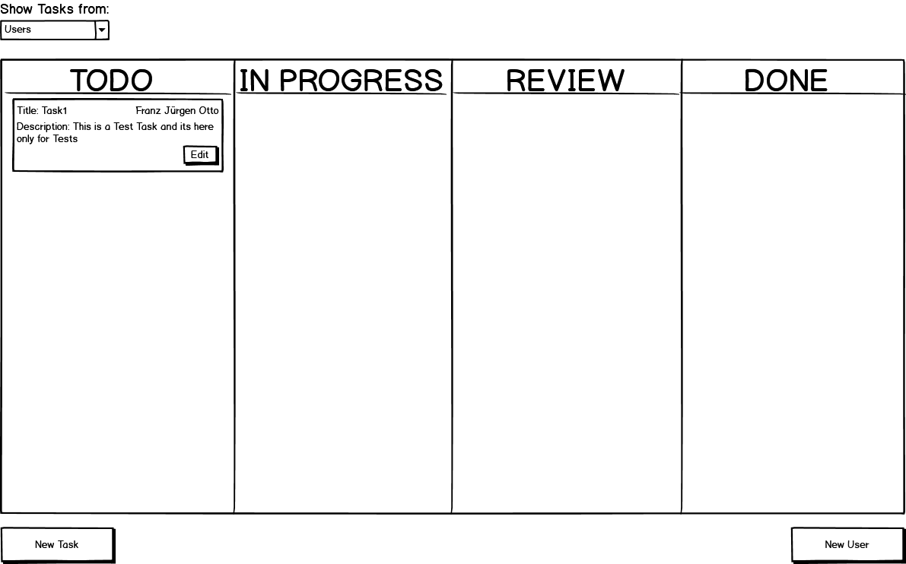

# M120 N-N_Scrumboard
## Inhaltsverzeichnis
* [Einleitung](#einleitung)
  * [Autor](#autor)
  * [Projekt](#projekt)
* [Planung](#planung)
  * [User Stories](#userstory)
  * [UseCase Diagram](#udiagramm)
  * [Mockups](#mockups)
* [Testing](#testing)
  * [Testfälle](#testfaelle)
  * [Testprotokoll](#testprotokoll)

<a name="einleitung"/>

## Einleitung

<a name="autor"/>

### Autor und Dokument
* Autor: **Noah Ziltener & Nick Durrer**
* Erstelldatum: **05.22.2020**
* letzte Aktualisierung: **12.03.2020**

<a name="projekt"/>

### Projekt
* Projektstart: **05.22.2020**   
* Projektende: **-** 

<a name="planung"/>

## Planung

<a name="userstory"/>

### User Stories

#### User Storie #1
    Als User,
    will ich einen Task mit Titel und Beschreibung ertstellen
    damit ich den Task im ToDo ansehen kann.
    
#### User Storie #2
    Als User,
    will ich einen Task per Drag and Drop in ein anderes Feld ziehen
    damit der Status des Taskt geändert wird.
    
#### User Storie #3
    Als User,
    will ich ein Task einer Person zuweisen
    damit der Task dieser Person untergeortnet ist.
    
#### User Storie #4
    Als User,
    will ich ein Tasks nach Person zu sortieren
    damit ich besser Überblick habe.
    
#### User Storie #5
    Als User,
    will ich neue Personen kit Name und Job erstellen
    damit ich Tasks neuen Personen zuweisen kann.

<a name="udiagramm"/>

### Mockups
####ScrumBoard

<a name="testing"/>

### Testfälle

<a name="testfaelle"/>

<a name="testprotokoll"/>

### Testprotokoll

| Test | Testperson | Datum | Status|
| ----------- | --------- | ------ | --------------------------------- | 
| - | - | - | ✅ / ❌  | 
| -| - | - | ✅ / ❌ | 
| -| - | -| ✅ / ❌  | 
| -| -| - | ✅ / ❌  | 
| - | - | - |✅ / ❌ |
| -    | - |-|✅ / ❌ |  

